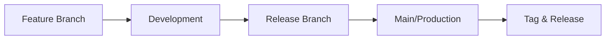

# Version Management

This document outlines the version control strategy, release process, and version history for the UPI Admin Dashboard.

**Author**: Sayem Abdullah Rihan (@code-craka)  
**Contributor**: Sajjadul Islam  
**Contact**: <hello@techsci.io>  
**Repository**: <https://github.com/code-craka/upi-payment-app>

## Semantic Versioning

This project follows [Semantic Versioning 2.0.0](https://semver.org/). Version numbers are structured as **MAJOR.MINOR.PATCH**:

### Version Structure

```
MAJOR.MINOR.PATCH[-PRERELEASE][+BUILD]
```

- **MAJOR**: Incompatible API changes or significant breaking changes
- **MINOR**: New functionality added in a backwards-compatible manner
- **PATCH**: Backwards-compatible bug fixes
- **PRERELEASE**: Optional pre-release identifier (alpha, beta, rc)
- **BUILD**: Optional build metadata

### Version Examples

- `1.0.0` - Major release with stable features
- `1.1.0` - Minor release with new features
- `1.1.1` - Patch release with bug fixes
- `2.0.0-alpha.1` - Pre-release version
- `1.0.0+20250916` - Release with build metadata

## Release Process

### Development Workflow



### Branch Strategy

- **`main`**: Production-ready code with stable releases
- **`development`**: Integration branch for active development
- **`feature/*`**: Individual feature branches
- **`release/*`**: Release preparation branches
- **`hotfix/*`**: Critical fixes for production

### Release Steps

#### 1. Pre-Release Preparation

```bash
# Create release branch from development
git checkout development
git pull origin development
git checkout -b release/1.1.0

# Update version in package.json
npm version minor --no-git-tag-version

# Update CHANGELOG.md
# Add release notes and changes
```

#### 2. Release Testing

```bash
# Run comprehensive tests
pnpm test
pnpm test:integration
pnpm test:e2e

# Build production version
pnpm build

# Security audit
pnpm audit

# Performance testing
pnpm test:performance
```

#### 3. Release Finalization

```bash
# Merge to main
git checkout main
git merge release/1.1.0

# Create and push tag
git tag -a v1.1.0 -m "Release version 1.1.0"
git push origin main --tags

# Merge back to development
git checkout development
git merge main
git push origin development

# Clean up release branch
git branch -d release/1.1.0
```

#### 4. Post-Release Actions

- Create GitHub release with release notes
- Update deployment environments
- Notify team and stakeholders
- Monitor for issues and feedback

## Version History

### Current Version: 1.0.0

#### [1.0.0] - 2025-09-16 - Redis Revolution Release

**Major Release - Redis Session Management System**

##### 🚀 New Features

- **Redis-First Session Management**: Instant role updates without logout
- **Enhanced Permission System**: 25+ granular permissions with real-time updates
- **Hybrid Authentication**: Redis primary with Clerk fallback
- **Session Auto-Refresh**: 30-day TTL with activity-based renewal
- **Debug Session API**: Comprehensive session diagnostics

##### 🔧 Technical Improvements

- **Performance**: Redis caching with optimized connection pooling
- **Security**: Enhanced session encryption and validation
- **Architecture**: Middleware improvements with Redis-first validation
- **Monitoring**: Structured logging and health checks

##### 📦 Dependencies

- Added `ioredis` for Redis client management
- Enhanced security middleware
- Improved error handling and fallback systems

---

### Development Versions

#### [0.9.0] - 2025-09-01 - Foundation Release

- Core payment system implementation
- Basic authentication with Clerk
- MongoDB integration with Mongoose
- Admin dashboard functionality
- Security middleware and CSRF protection

#### [0.8.0] - 2025-08-15 - Beta Release

- Payment processing workflows
- QR code generation and UTR validation
- User management system
- Audit logging implementation

#### [0.7.0] - 2025-08-01 - Alpha Release

- Next.js 14 App Router setup
- Database schema design
- Authentication infrastructure
- Basic UI components with ShadCN

## Release Planning

### Version 1.1.0 - Enhanced Analytics (Planned: Q4 2025)

- **Features**: Advanced analytics dashboard, export functionality
- **Improvements**: Performance optimizations, mobile responsiveness
- **Dependencies**: Chart.js integration, enhanced reporting

### Version 1.2.0 - Multi-Language Support (Planned: Q1 2026)

- **Features**: i18n implementation (Hindi, Bengali, Tamil)
- **Improvements**: Localized UI components, currency formatting
- **Dependencies**: react-i18next, locale management

### Version 2.0.0 - Architecture Evolution (Planned: Q2 2026)

- **Breaking Changes**: API versioning, database schema updates
- **Features**: Microservices architecture, advanced webhook system
- **Migration**: Automated migration tools and guides

## Version Management Commands

### Development Commands

```bash
# Check current version
npm version

# Update patch version
npm version patch

# Update minor version
npm version minor

# Update major version
npm version major

# Create pre-release version
npm version prerelease --preid=alpha
```

### Release Commands

```bash
# Build for production
pnpm build

# Run production tests
pnpm test:prod

# Security audit
pnpm audit fix

# Generate release notes
git log --oneline --since="2025-09-01"
```

## Breaking Changes Policy

### Major Version Changes

Breaking changes are only introduced in major versions and include:

- API endpoint changes or removals
- Database schema modifications requiring migration
- Configuration format changes
- Dependency updates with breaking changes
- Authentication/authorization changes

### Migration Support

For each major version:

- **Migration Guide**: Step-by-step upgrade instructions
- **Deprecation Warnings**: One major version notice before removal
- **Migration Tools**: Automated migration scripts when possible
- **Support Period**: Previous major version supported for 6 months

### Communication

Breaking changes are communicated through:

- CHANGELOG.md with detailed migration notes
- GitHub releases with breaking change highlights
- Email notifications to users and maintainers
- Documentation updates with migration paths

## Support Lifecycle

### Long-Term Support (LTS)

- **Current LTS**: Version 1.0.0 (supported until Sept 2026)
- **Next LTS**: Version 2.0.0 (planned for Q2 2026)
- **Support Duration**: 18 months from release date

### Security Updates

- **Critical Security**: All supported versions receive immediate patches
- **Security Patches**: Released within 48 hours of discovery
- **CVE Management**: Proper CVE reporting and tracking

### End of Life (EOL)

- **Notice Period**: 6 months advance notice before EOL
- **Final Updates**: Security patches until EOL date
- **Migration Path**: Clear upgrade path to supported versions

## Version Information API

The application exposes version information through:

```http
GET /api/version
```

**Response:**

```json
{
  "version": "1.0.0",
  "buildDate": "2025-09-16T10:30:00Z",
  "commitHash": "a1b2c3d4",
  "environment": "production",
  "dependencies": {
    "nextjs": "14.2.0",
    "mongodb": "5.9.0",
    "redis": "6.2.14"
  }
}
```

## Quality Gates

Each release must pass the following quality gates:

### Code Quality

- ✅ TypeScript compilation without errors
- ✅ ESLint passing with zero warnings
- ✅ Prettier formatting applied
- ✅ No security vulnerabilities in dependencies

### Testing

- ✅ Unit test coverage ≥ 80%
- ✅ Integration tests passing
- ✅ E2E tests covering critical paths
- ✅ Performance regression tests

### Security

- ✅ Security audit passing
- ✅ Authentication and authorization tests
- ✅ CSRF protection verified
- ✅ Input validation comprehensive

### Documentation

- ✅ CHANGELOG.md updated
- ✅ API documentation current
- ✅ Migration guides prepared
- ✅ Release notes complete

---

**Version Management Contact**: <hello@techsci.io>  
**Last Updated**: September 16, 2025  
**Next Review**: December 16, 2025
